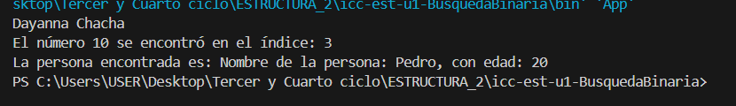

# Práctica de Metodo de Busqueda Binaria

## 📌 Información General

- **Título:** Práctica de Metodo de Busqueda Binaria
- **Asignatura:** Estructura de Datos
- **Carrera:** Computación
- **Estudiante:** Janelly Dayanna Chacha Vélez
- **Fecha:** 18/11/2025
- **Profesor:** Ing. Pablo Torres
---
## Codigo en Java busqueda Binaria

---
